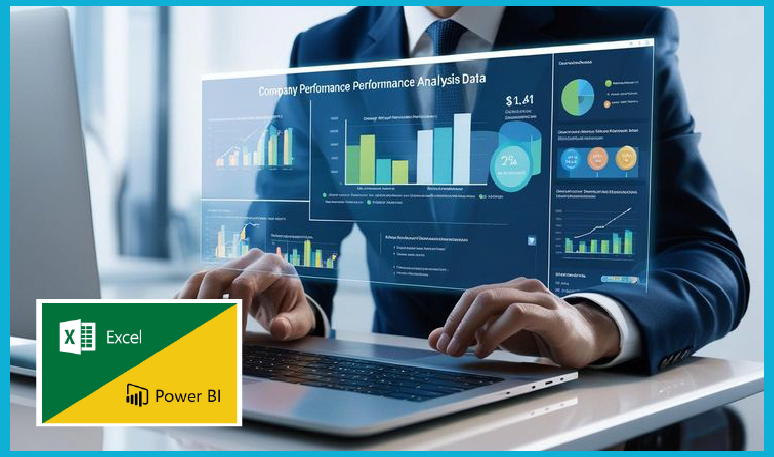
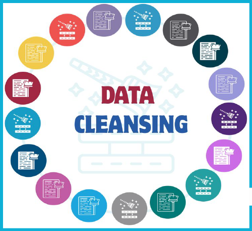

# DATA ANALYST

## About Me
**Detail-oriented Data Analyst with expertise in transforming large raw datasets into actionable insights 
to protect revenue and data drive strategic decision-making. 
Skilled in SQL, Python, Excel and visualization tools (Power BI, Tableau) with hands-on experience.
Experienced in cleaning, analyzing and interpreting datasets to support business strategic recommendati. I bridge the gap between technical analysis and commercial strategy.**

## Skills
-  #### Techincal Skills:  Credit Risk Modeling,   Analytics Techniques, PAR Calculations, Financial Forecasting,CRM ,Financial modeling, Budget management Techniques, Reporting/Presenting, Visualizing data .
- #### Interpersonal Skills: Verbal Communication,  Relationship-Building, Leadership Skills, Approachability, TeamworkProblem-Solving, Adpotibilty.
- #### Technical Tools: SQL(PostgreSQL, MySQL), Power BI (DAX), Tableau, Microsoft Excel(Power Query, Macro,Pivot Table), Python.

## Education.
- Bachelor of Science in Business Computing and Data Analytics.
       *Victoria University, Kampala 2020-2023*
- Diploma in MY SQL and Statistics for Data Analysis.
       *Alison online - 2021.*
  
### Certifications.
- Certificate in Credit Analyst Job Simulation.
      *Forage-2026*
- Certificate in Introduction to Cybersecurity Awareness.
      *HP LIFE online Course-2024*
- Certificate in Effective Leadership.
     *HP LIFE online Course-2024*
- Certificate in Effective Presentations.
     *HP LIFE online Course-2024*
- Certificate in Nursing Assistant CNA.
     *Strong Point Educational And Training Institute - January 2023-March 2023*
- Certificate in Nursing Assistant CNA.
     *American Medical Certification Association -2023*
- Certificate in Graphics Design.
    *AFFCAD Vocational Institute-2019*

## Experience.

### DataAnalyst- Business Development-Soccanett kampala  *2023 - Present*
- Developed and maintained dashboards using tools like Power BI, Tableau, Excel and SQL 
to track sales performance, customer’s behavior plus market trends hence
enabling data-backed decision-making for the market and finance department. 

- Conducted analysis of client data and competitive landscapes to support the creation of
 targeted pitches, proposals and pricing strategies through data insights.

- Served as the key link between data operations and commercial teams,
 translating business questions into analytical projects and data insights
 into actionable recommendations.

### Product Analyst  - Freelance Project (Remote)  2022.
- Conducted quantitative analysis of user engagement data to evaluate feature adoption
and performance, providing insights that influenced the product roadmap for the client projects.
-  Established key product metrics like user retention and built dashboards to monitor
product health, enabling data-driven prioritization.
- Conducted exploratory data analysis (EDA) to identify fraudulent transaction patterns using
My SQL which helped shareholders to detect fraud transactions by 65%.

# My Projects.
## Business Performance Analysis

[FOR MORE INFORMATION **click here**]( https://github.com/SsenfumaGodfrey/My-Portfolio-As-Data-Analyst/blob/main/README.md )

- Fing Fong's sales analysis from **December 2024 to June 2025**, **$513.98k as total revenue and 100.04k cellphones or mobile phones** being shipped over that period.
  U.S.A is the top best performancing country contributing 53.34% on the total revenue earned between december 2024 and june 2025, Followed by United Kingdom in the second position with $106.01k on the total revenue. Germany and Canada being the worst performancing countries with the average order value of $66.91k.

  -  Optimizing bundle and enhancing loyalty program to increase customer lifetime value. Targeted growth in Germary and Canada along with improvement to digital channels like mobile Apps and running social media campaigns ads, will strengthen Fing Fong market position and drive sustainable growth.
  

## Data Cleaning & Preprocessing (Using SQL)

**🧹 Dirty Data = Wrong Decisions.
Here’s why 80% of Data Science is just... cleaning.**
**Before the dashboards, before the models. . . . your data has to make sense.** 
- Yet many skip the most crucial step: Data Cleaning & Preprocessing.

[FOR MORE INFORMATION **click here**](https://github.com/SsenfumaGodfrey/Data-Cleaning-Process/blob/main/README.md)

  - 🧩 Messy data = misleading insights.
  - 📉 Inconsistent data = broken algorithms.
  - 🤖 Even AI fails without clean input.

- Identified and ingested a "dirty" dataset containing over 3000 rows.
- Transformed raw, unstructured strings and inconsistent formats into a reliable source of truth for downstream analytics.
    - Standardizing Strings: Leveraged TRIM(), UPPER(), and INITCAP() to resolve inconsistent naming conventions and remove trailing white spaces.
    - Handling Nulls: Utilized COALESCE() and CASE statements to replace null values with "Unknown" or relevant defaults, ensuring $100\%$ row usability for reporting.
- Developed Common Table Expressions (CTEs) combined with ROW_NUMBER() and PARTITION BY to identify and remove duplicate records without losing data integrity.
- Successfully eliminated 85% of duplicate entries, reducing storage overhead and preventing double-counting in sales reports.
- Improved data reliability by 100%, verified by comparing post-clean aggregate totals against raw source audits.
- Automated the cleaning pipeline with a reusable SQL script, reducing manual data preparation time from hours to seconds.

- <a href = "SSENFUMA GODFREY. data.pdf"> Download MY CV **click here.**  </a>

- [LinkedIn](https://www.linkedin.com/in/ssenfuma-godfrey-b51a3137b/)

- **Email:   godfrey.ssenfuma97@gmail.com**
- **Contact: +256 701 405 492  +256 777 642 922**
- **Address: Kampala Uganda.
